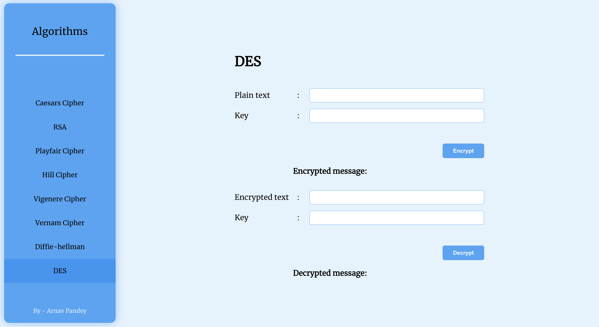

# Crypto Website

## Welcome to my cryptographic website!
Where we have implemented various cipher algorithms to help you keep your messages and data secure.
My website offers a user-friendly interface that allows you to easily access and use encryption and decryption tools. We have implemented several popular and robust ciphers, including the Caesar Cipher, Vigenère Cipher, Playfair Cipher, and more.

## How to start
 - Clone the repositorie using `git clone <URL>`
 - Install the dependencies using `npm install`
 - Start website by running `npm start`
 

## Preview

#### By- Arnav Pandey
